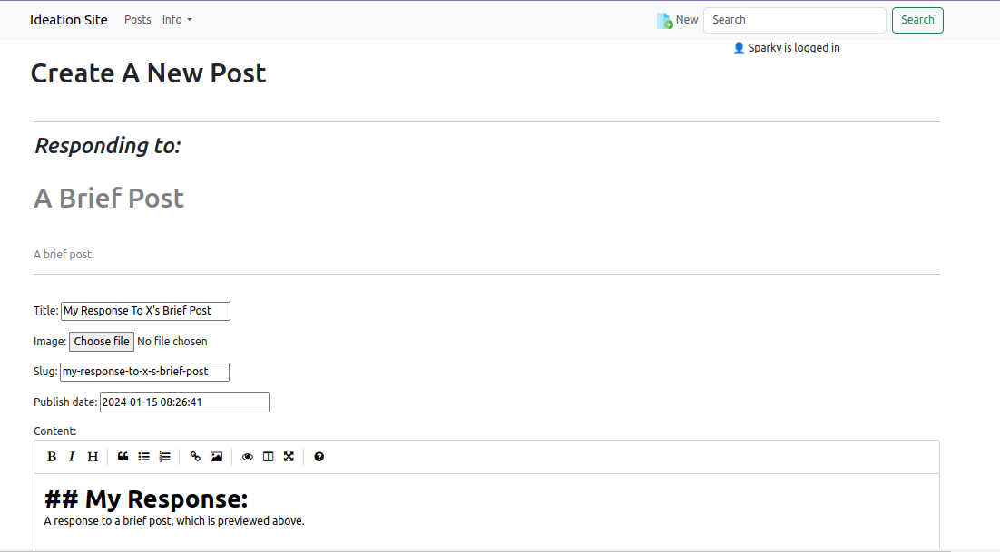
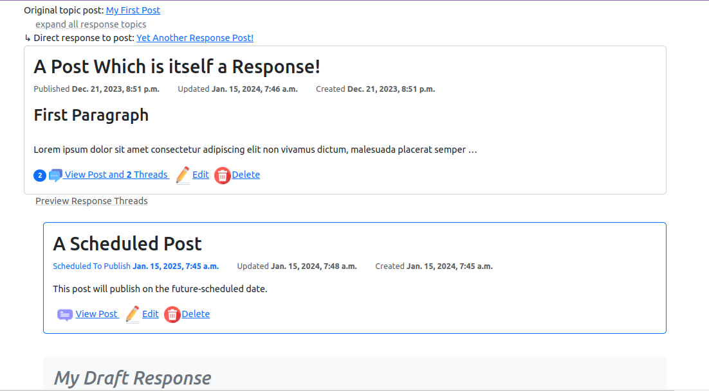
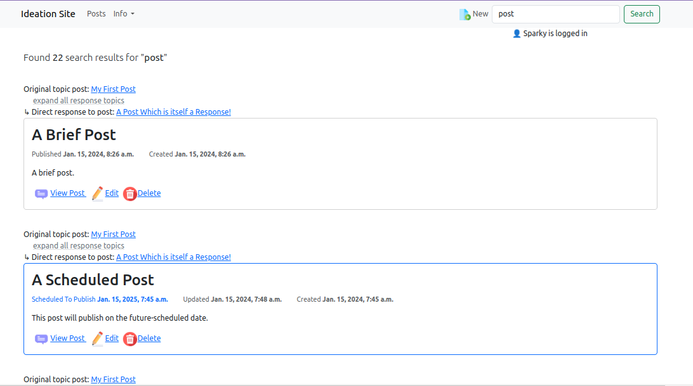

# Ideation Website

A discussion-building site where people contribute posts and build on/critique each other's posts. Responses can also become new topic threads, in recursive fashion.

## Post Topics and Responses in Markdown
**Markdown**: Posts support Markdown with a pretty markdown widget for easy formatting.

## Posts Navigation and Previewing
**Expandable Threads**: _All_ response threads can be recursively previewed (expandable) on the same page as the current post to avoid clicking back and forth.

**Expandable Breadcrumbs**: Similarly, _all_ higher level posts that spawned a post can are visible in expandable breadcrumbs.

## Searching
**Multi-filter Search**: Searches posts for matches in title, keywords, slugs, username or user's first name.

## Attributions:
See <a href="attributions.md">attributions.txt</a> for icon attributions.
